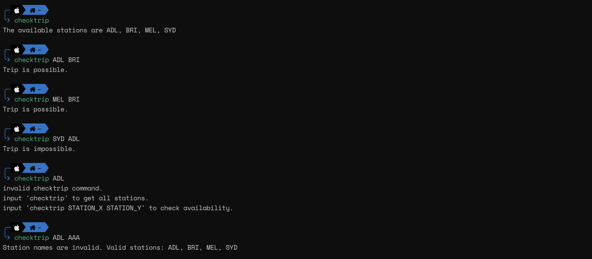

# **Checktrip**

Code Written by : MD RAFAYET ALAM

Code Written in : `Ruby 2.4.0`

### **RUN PROGRAM**

I've previously added the folder `/usr/local/bin` to my PATH. so I know that if I drop an executable script in there or symlink any executable file I should be able to run it by just typing its name.

First, unzip the folder where you want it to store the program.

the `cd` into the folder 'piktochart_assessment' and run install.sh by typing ` ./install.sh`.

This should install the program and if nothing goes wrong the program can be used easily. Please check the following image-

To run test cd into the folder 'piktochart_assessment' the folder and run `ruby checktrip_test.rb`

### **UNINSTALL PROGRAM**

To uninstall the program run uninstall.sh  by typing ` ./uninstall.sh`.
